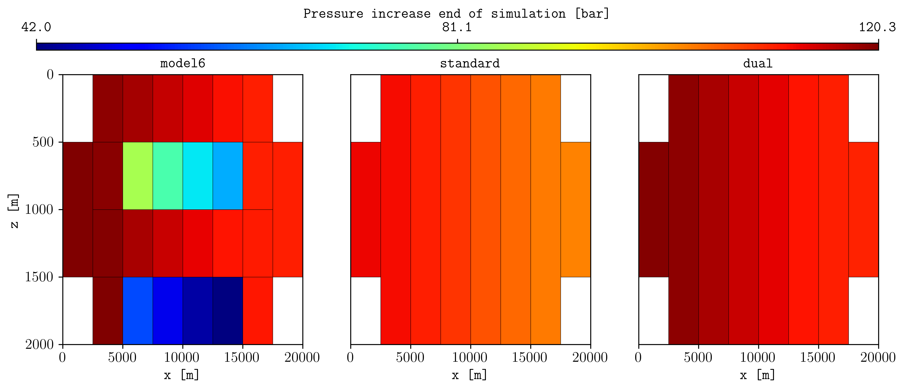

.. _example-dual-coarsening:

Dual coarsening
===============
The flag **-dual** allows to perform a coarsening by differentiating between net and non-net cells, resulting in
two coarsened grids. For example, using the `MODEL6.DATA <https://github.com/cssr-tools/pycopm/blob/main/examples/decks/MODEL6.DATA>`_:

.. code-block:: bash

    pycopm -i MODEL6.DATA -z 1:4 -w STANDARD -l S -t 2 -a max
    pycopm -i MODEL6.DATA -z 1:4 -w DUAL -dual 'poro <= 0.1' -l D -t 2 -a max
    flow MODEL6.DATA
    flow STANDARD.DATA
    flow DUAL.DATA
    plopm -i 'MODEL6 STANDARD DUAL' -v 'pressure - 0pressure' -sg 1,3 -rdl 1 -cbp 0.1,0.95,0.8,0.02 -fs 12,4  -st 0 -asp 0 -cbl 'Pressure increase end of simulation [bar]' -ge 'black,1e-2'

This results in the following figure, where the pressure on the most right cell compares better using the dual coarsening than the standard:

    Figures using plopm, see/run `docs_via_deck_dual_coarsening.sh <https://github.com/cssr-tools/pycopm/blob/main/tests/scripts/docs_via_deck_dual_coarsening.sh>`_.
